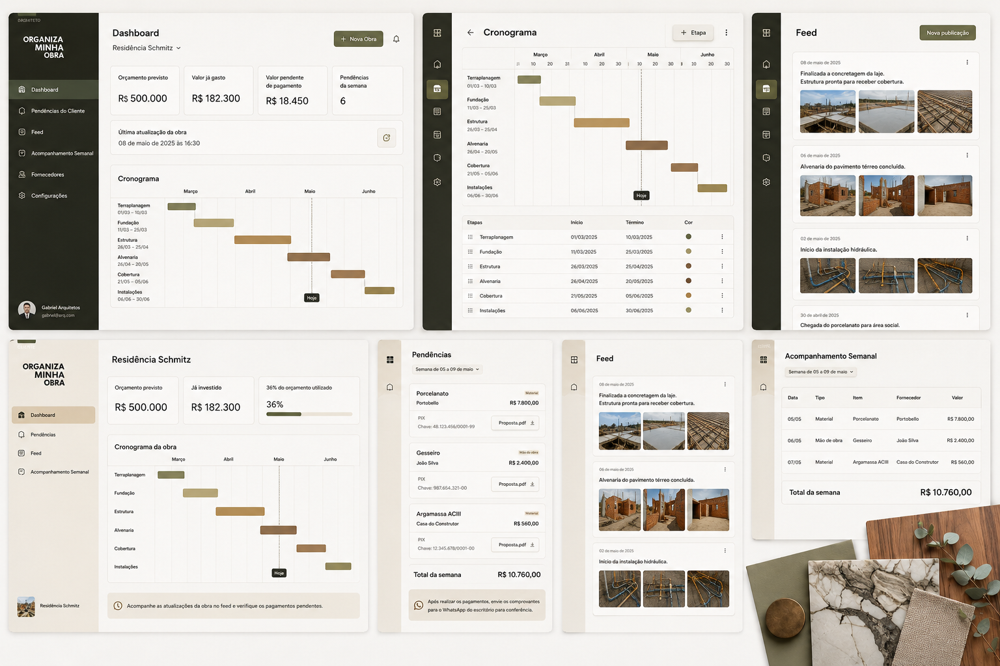

# (BRD) Documentação de Requisitos do Negócio - MVP

<aside>

**Esse é o MVP do MVP que queremos modernizar 😅**

[Comece por aqui!.pdf](./src/Comece_por_aqui!.pdf)

</aside>

Apenas uma referência de front.

- Elegância.
- Premium.
- Esteticamente satisfatório e fácil para qualquer bípede entender.

## Versão

1.0

## Objetivo

Desenvolver um SaaS para comunicação entre arquiteto e cliente durante a execução da obra.

O sistema **não pretende substituir um ERP de obras**, nem ser um software completo de orçamento ou planejamento.

Seu objetivo é tornar a comunicação extremamente simples e transparente, permitindo que:

- o arquiteto registre as informações da obra uma única vez;
- o cliente acompanhe tudo em tempo real;
- as solicitações de pagamento sejam organizadas automaticamente.

---

# Proposta de Valor

> Um aplicativo onde o arquiteto registra a obra e o cliente apenas acompanha.

> O arquiteto e o cliente falando a mesma língua.

Toda a comunicação fica organizada em um único lugar.

---

# Público-alvo

## Usuário Principal

Arquitetos que fazem gerenciamento de obras.

---

## Usuário Secundário

Clientes desses arquitetos.

O cliente possui acesso somente leitura.

Ele nunca altera informações dentro do sistema.

---

# Conceito

O sistema possui dois perfis:

## Arquiteto

Responsável por alimentar todas as informações.

## Cliente

Responsável apenas por acompanhar a obra.

---

# Módulos do Sistema

## 1. Dashboard

## Arquiteto

Exibir:

- Nome da obra
- Orçamento previsto
- Valor já gasto
- Valor pendente de pagamento
- Quantidade de pendências da semana
- Última atualização da obra

Objetivo:

Dar uma visão operacional rápida da obra.

---

## Cliente

Exibir:

### Orçamento previsto

Exemplo

R$ 500.000

---

### Valor já investido

Exemplo

R$ 182.300

---

### Barra de progresso financeiro

Mostrar a porcentagem do orçamento já utilizado.

Exemplo

36%

████████░░░░░░░░

---

### Cronograma Gantt

Mesmo cronograma utilizado pelo arquiteto.

Exibir:

- etapas
- barras
- linha vertical tracejada indicando o dia atual

Objetivo:

Permitir que o cliente entenda rapidamente em qual fase a obra se encontra.

Cada etapa possui:

- Nome
- Data inicial
- Data final
- Cor

Funcionalidades para arquiteto:

- arrastar barras
- alterar duração
- editar datas
- adicionar etapa
- excluir etapa
- reorganizar ordem

---

# 2. Feed

Disponível para ambos.

Objetivo:

Registrar a evolução da obra.

Cada publicação contém:

- data
- texto
- fotos (opcional)
- vídeos (opcional)

Todo post publicado pelo arquiteto aparece automaticamente para o cliente.

Ordem:

Mais recente primeiro.

---

# 3. Acompanhamento Semanal

Principal módulo operacional do sistema.

Objetivo:

Registrar tudo que foi comprado durante a semana.

Cada lançamento possui:

- Data
- Tipo
  - Material
  - Mão de obra
- Item
- Fornecedor
- Valor

Exemplo

| Data  | Tipo     | Item        | Fornecedor | Valor   |
| ----- | -------- | ----------- | ---------- | ------- |
| 04/08 | Material | Porcelanato | Portobello | R$7.800 |

O cliente possui acesso somente leitura e recebe uma notificação no dia escolhido com o que precisa pagar da semana.

---

# 4. Pendências

Tela exclusiva para o cliente visualizar os pagamentos da semana.

O arquiteto cria as pendências automaticamente através dos lançamentos do acompanhamento semanal.

Cada cartão contém:

- Item
- Tipo
- Fornecedor
- Valor
- Forma de pagamento
- Dados bancários ou PIX
- PDF da proposta (opcional)

---

No final da tela:

Total da semana

R$ 18.450

---

Mensagem fixa solicitando envio do comprovante via WhatsApp.

O cliente não possui nenhuma ação dentro do sistema.

---

# Lista de Fornecedores (cadastro)

Apenas para o arquiteto.

Cadastro simples.

Campos:

Nome

Forma de pagamento

Dados de pagamento

Objetivo:

Preencher automaticamente os dados das pendências.

---

# Fluxo Operacional

## Durante a semana

O arquiteto:

- atualiza o feed
- registra compras
- registra mão de obra
- ajusta o cronograma

---

## Sexta-feira

O sistema:

- organiza automaticamente os lançamentos da semana
- soma os valores
- disponibiliza as pendências ao cliente

---

# Regras de Negócio

## Cliente

Pode:

- visualizar dashboard
- visualizar feed
- visualizar pendências
- visualizar acompanhamento semanal

Não pode:

- editar
- adicionar
- excluir
- comentar
- enviar comprovantes
- marcar pagamentos

Todo pagamento acontece fora do sistema por enquanto.

---

## Arquiteto

Pode:

- criar obras/clientes
- editar cronograma
- cadastrar fornecedores
- cadastrar compras
- publicar no feed
- anexar PDFs
- editar qualquer informação

---

# Estrutura de Navegação

## Arquiteto

Dashboard

↓

Pendências do Cliente

↓

Feed

↓

Acompanhamento Semanal

---

## Cliente

Dashboard

↓

Pendências

↓

Feed

↓

Acompanhamento Semanal

---

# MVP

O MVP deverá conter apenas:

- Login
- Cadastro de obras/clientes
- Dashboard
- Cronograma Gantt
- Feed
- Cadastro de fornecedores
- Acompanhamento semanal financeiro
- Pendências
- Upload de PDF
- Upload de fotos
- Upload de vídeos
